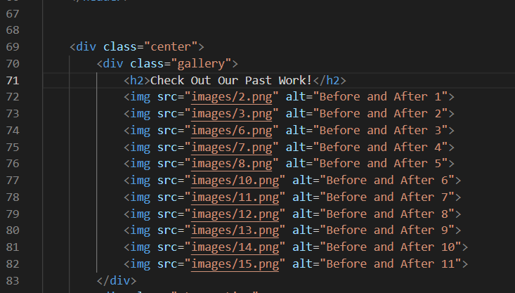

# How to Add Images to Gallery

### Accessing for the First Time
1. Go to the top of this page and click the green code button and copy the HTTPS url
2. Go to your VSCode Window and click "Open Folder" 
3. Select the folder where you want to store the code, choose desktop if you're not sure
4. Click "Terminal" at the top of the window and select "New Terminal"
5. In the terminal, type "git clone _____" replace the blank with the url you copied earlier, a new folder will appear on the left column called "vandanpw.github.io", expand the folder to access files in the folder

### Modifying the images
1. Add the new images you took into the "images" folder, this can be done by moving your images in File Explorer
2. Once the new images are added, open the "gallery.html" file in VSCode, you should be able to find it in the left column
3. Locate this section of the code:  
  
4. Notice that each line that starts with "img src" is an image. To add a new image you can copy one of the lines and add it to the end of the list then change the "src" field of the line to the name of your new image. You can also modify the "alt" field to differentiate your new image.
5. Once you have added your new image(s) go to the terminal or open a new terminal and type "cd vandanpw.github.io"
6. Type "git add ." and press enter
7. Type "git commit -m "Gallery Update" and press enter
8. Type "git push" and press enter
9. Wait 1-4 minutes and you should see the change on the website
10. If anything goes wrong message me
